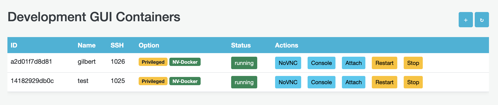
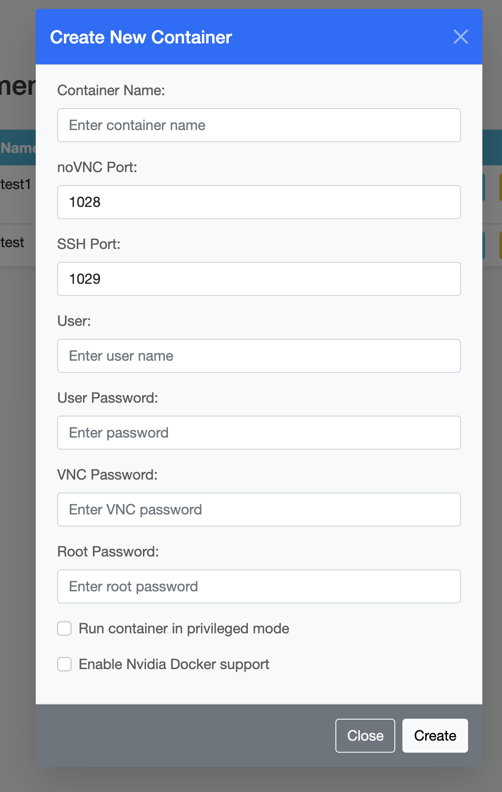
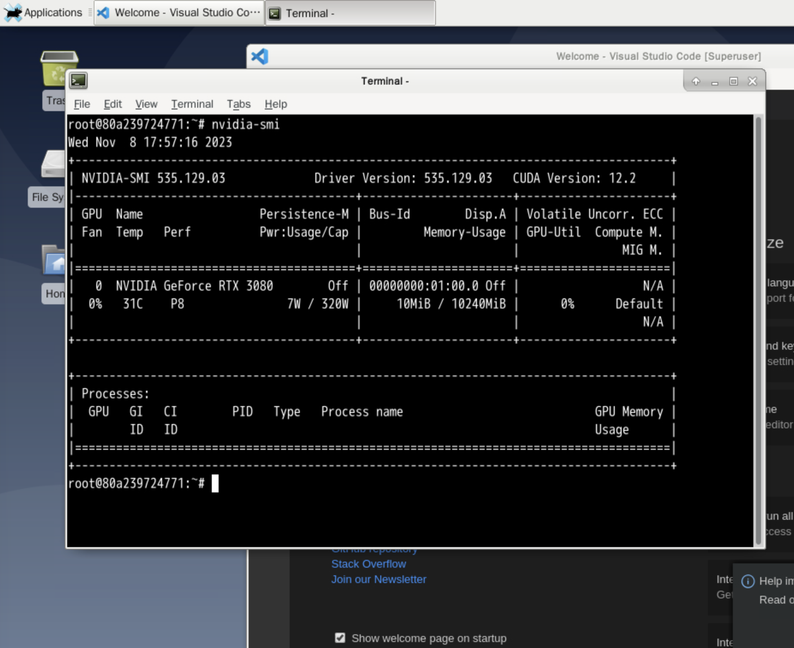
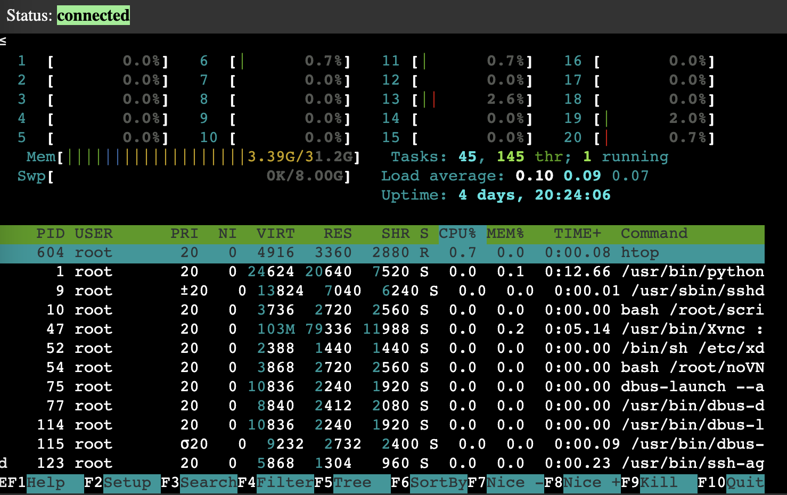

<div align="center" style="text-align: center">

# **Dev Dock Manager**

<p style="text-align: center">
  
</p>

This is a SAAS tool for managing docker containers with GUI developed using Django, providing isolated development environments with a suite of base functions and packages for each user on the same machine.


</div>

This project combines the following repositories:
- [Dev Dock](https://github.com/NatLee/dev-dock)
- [Django Docker GUI](https://github.com/NatLee/django-docker-gui)

## Contains

- Traefik

    This tool is used to proxy containers of multi-GUI NoVNC in the main port.

- Django Dashboard

    The dashboard of GUI container list is developed by using Django framework.

- Nvidia Docker Checker

    `docker-compose.yml` contains service of `nvidia-cuda` and it's used to check the host can run Nvidia docker or not.

- NoVNC & SSH Support

## Nvidia Docker Support

Nvidia Docker support is available under certain conditions.

Ensure your system has Nvidia drivers installed and the Nvidia Docker runtime is set up correctly.

This feature is optional and can be enabled during container creation if your system meets the requirements.

# Usage

> Only support Linux-based machine because it uses Docker socket to interact with Docker daemon.

> In Windows, you need to use Docker in WSL.

Notice that you need to clone the submodule at the first.

```
git submodule update --init --recursive
```

## Quick start

> Docker daemon must be running.

1. Build GUI container.

```
cd gui && docker-compose build
```

2. Back to the root of this repo and use command to start the web service.

```
docker network create d-gui-network
docker-compose build && docker-compose up -d
```

3. Create a superuser for Django admin.

> Check the script `./dev-create-superuser.sh` and change the username and password if you want.

```
bash dev-create-superuser.sh
```

4. Go to http://localhost:8000/dashboard, it will show the login page.

## Interface

- Container list

    

- Container creation form

    

- Container with NoVNC

    

- Web terminal

    

# License

[MIT](./LICENSE)

